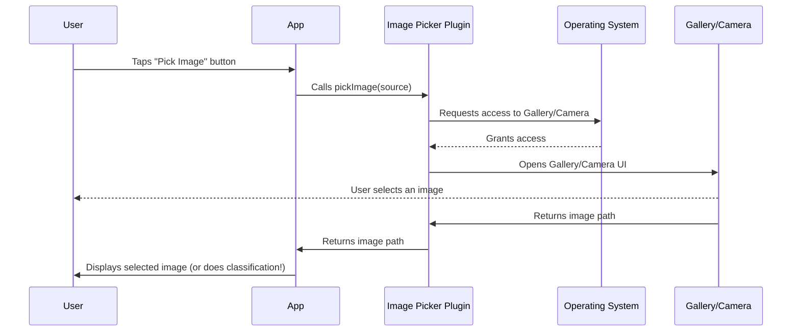

# Chapter 1: Image Picker (`image_picker` package)

Welcome to the first step in building your cat and dog classification app! In this chapter, we'll explore how to let your app "see" images. We'll be using the `image_picker` package, which acts like the app's eyes and hands, allowing it to grab pictures from your device.

**Why do we need an Image Picker?**

Imagine you want to show your app a picture of your pet and ask, "Is this a cat or a dog?". Your app needs a way to get that picture first!  The `image_picker` package provides that way.  It allows the user to select an image from their phone's gallery or even take a new picture directly with the camera. This selected image is then the *input* to our cat and dog classification model.

**Key Concept: Picking an Image**

The core idea behind `image_picker` is simple: it lets the user choose an image. This choice can come from two main sources:

1.  **Gallery:**  The user's photo library.
2.  **Camera:** Taking a new picture on the spot.

Think of it like ordering food. You have two choices: order from what's already available (gallery) or ask for something to be made fresh (camera).

**How to Use `image_picker`**

Let's see how to use this package to get an image.  Here's a basic snippet:

```dart
import 'package:image_picker/image_picker.dart';

final ImagePicker _picker = ImagePicker();
final XFile? image = await _picker.pickImage(source: ImageSource.gallery);

```

What's happening here?

1.  `import 'package:image_picker/image_picker.dart';`: This line brings in the `image_picker` package so we can use its features.  It's like opening the door to a special toolbox.
2.  `final ImagePicker _picker = ImagePicker();`: This creates an instance of the `ImagePicker` class.  Think of it as getting your hands on the actual image picking tool.
3.  `final XFile? image = await _picker.pickImage(source: ImageSource.gallery);`:  This is the most important line.  It tells the `image_picker` to open the gallery and let the user pick an image. `ImageSource.gallery` specifies the gallery as the source. The `await` keyword means the app will wait for the user to pick an image before continuing. The selected image (if any) is stored in the `image` variable. If the user cancels, `image` will be `null`.

**Example Input and Output**

*   **Input:** The user taps a button in the app that triggers the code snippet above. The phone's gallery opens. The user selects a picture of their dog.
*   **Output:** The `image` variable will contain information about the selected dog picture, like its file path. If the user closes the gallery without picking an image, `image` will be `null`.

To use the camera, you'd change `ImageSource.gallery` to `ImageSource.camera`:

```dart
import 'package:image_picker/image_picker.dart';

final ImagePicker _picker = ImagePicker();
final XFile? image = await _picker.pickImage(source: ImageSource.camera);
```

Now, when the user taps the button, the camera will open, allowing them to take a new picture.

**Under the Hood: How `image_picker` Works**

Let's take a simplified look at what happens when you use `image_picker`:



1.  The user interacts with your app.
2.  Your app uses the `image_picker` package to request access to the device's gallery or camera.
3.  The operating system (like Android or iOS) asks the user for permission.
4.  If permission is granted, the gallery or camera opens, and the user selects an image.
5.  The `image_picker` package gets the path to the selected image.
6.  Your app can then use that image path to display the image or, in our case, classify it as a cat or dog!

**Diving Deeper: `pubspec.yaml`**

Before you can use `image_picker`, you need to add it to your project's dependencies. This is done in the `pubspec.yaml` file.  This file is like a recipe for your app, listing all the ingredients (packages) it needs.

In the provided `pubspec.yaml` file, you'll see this line under `dependencies`:

```yaml
  image_picker: ^0.8.4+8
```

This line tells Flutter to include the `image_picker` package, version 0.8.4+8 or higher.  Make sure this line is present in your `pubspec.yaml` file. Flutter will automatically download and install it when you run `flutter pub get`.

**Important Note:**

On iOS, you'll also need to add usage descriptions to your `Info.plist` file (found in `ios/Runner/Info.plist`). These descriptions tell the user *why* your app needs access to their camera and photo library. If you don't add these, your app might crash when trying to use the camera or gallery. You'll need to add the following:

*   `NSPhotoLibraryUsageDescription` - For accessing the photo library
*   `NSCameraUsageDescription` - For accessing the camera

**Conclusion**

In this chapter, you learned how to use the `image_picker` package to allow your app to access images from the device's gallery or camera. This is a crucial first step in building our cat and dog classification app, as it provides the input for our model.

Now that we know how to get images, let's learn how to manage those images in our project by using the [Asset Management (assets/ directory)](02_asset_management__assets__directory__.md).


---

Generated by [AI Codebase Knowledge Builder](https://github.com/The-Pocket/Tutorial-Codebase-Knowledge)