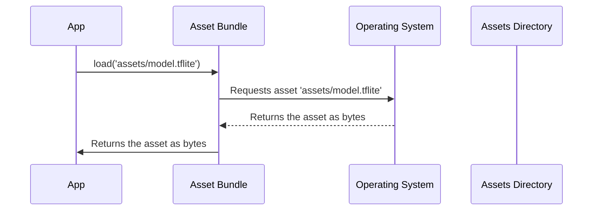

# Chapter 2: Asset Management (assets/ directory)

In the previous chapter, [Image Picker (`image_picker` package)](01_image_picker___image_picker__package__.md), we learned how to let our app "see" images by picking them from the gallery or taking them with the camera. Now, let's talk about where our app keeps its *stuff*. Think of it like this: you've taken a photo to show a friend (the app). But where do you keep that photo so you can find it again later?  That's where Asset Management comes in!

**Why do we need Asset Management?**

Our cat and dog classification app needs a place to store the TFLite model (which does the actual classifying) and any other files it might need, like default images.  Imagine baking a cake: you need a place to store all the ingredients (flour, sugar, eggs) before you start baking. The `assets/` directory is like the pantry in your app! It's where we store all the essential ingredients our app needs to function correctly.

**Key Concept: The `assets/` Directory**

The `assets/` directory is a special folder in your Flutter project where you can store files that your app will use. These files can be anything from images and audio files to text files and, most importantly for our project, the TFLite model.

**Key Concept: The `pubspec.yaml` File**

But how does Flutter know *which* files in the `assets/` directory are important for our app? That's where the `pubspec.yaml` file comes in.  This file is like a table of contents for your app. It tells Flutter what dependencies (like the `image_picker` package we used earlier) and assets your app needs.

**How to Use the `assets/` Directory**

Let's say we want to store our TFLite model, named `model.tflite`, in the `assets/` directory.  Here's how we would do it:

1.  **Create the `assets/` directory:** If you don't already have one, create a folder named `assets` in the root of your Flutter project.
2.  **Put the file in the directory:** Place your `model.tflite` file inside the `assets/` directory.
3.  **Declare it in `pubspec.yaml`:**  Add the following lines to your `pubspec.yaml` file, under the `flutter` section:

```yaml
flutter:
  assets:
    - assets/
```

What's happening here?

*   `flutter:`: This tells Flutter that we're about to define Flutter-specific settings.
*   `assets:`: This tells Flutter that we're about to list the assets our app needs.
*   `- assets/`: This tells Flutter to include *all* files in the `assets/` directory in our app. You can also specify individual files, like `- assets/model.tflite`, if you only want to include specific assets.

**Example Input and Output**

*   **Input:** You have a file named `model.tflite` and you've added the `assets/` entry to your `pubspec.yaml` file.
*   **Output:** When you run your Flutter app, the `model.tflite` file will be packaged with your app and accessible at runtime.  Your app can then load the model and use it for cat and dog classification!

**Important:** After modifying the `pubspec.yaml` file, you *must* run `flutter pub get` in your terminal to update your project's dependencies and assets. This command tells Flutter to go and "get" all the things declared in your `pubspec.yaml` file.

**How to Load Assets in Code**

Now that we've stored our TFLite model in the `assets/` directory, how do we actually *use* it in our code? Here's a simple example:

```dart
import 'package:flutter/services.dart';

Future<String> loadModel() async {
  return await rootBundle.loadString('assets/labels.txt');
}
```

What's happening here?

*   `import 'package:flutter/services.dart';`: This imports the `services` library, which provides access to platform services like asset loading.
*   `rootBundle.loadString('assets/labels.txt')`: This loads the content of `labels.txt` from the assets directory as a String. Here `labels.txt` is an example file to demonstrate loading files. In the actual Cat-Dog classification app, we need to load `model.tflite`.

**Under the Hood: How Asset Loading Works**

When you load an asset using `rootBundle`, Flutter does the following:



1.  Your app calls `rootBundle.load()`.
2.  The `AssetBundle` asks the operating system (Android or iOS) for the asset file.
3.  The operating system retrieves the file from the app's bundle (which includes the `assets/` directory).
4.  The `AssetBundle` returns the file's contents to your app.

**Diving Deeper: `AssetBundle`**

The `AssetBundle` is a class that provides access to assets bundled with your application. The `rootBundle` is a default `AssetBundle` instance that you can use to access assets.

The `AssetBundle` handles the complexity of locating and loading assets from different sources, such as the file system or network.

**Conclusion**

In this chapter, you learned how to use the `assets/` directory to store your app's resources, including the TFLite model. You also learned how to declare these assets in the `pubspec.yaml` file and how to load them in your code using `rootBundle`. This is a crucial step in building our cat and dog classification app, as it ensures that our model is available when the app runs.

Now that we know how to manage our assets, let's learn more about the [TFLite Model](03_tflite_model_.md) itself in the next chapter!


---

Generated by [AI Codebase Knowledge Builder](https://github.com/The-Pocket/Tutorial-Codebase-Knowledge)