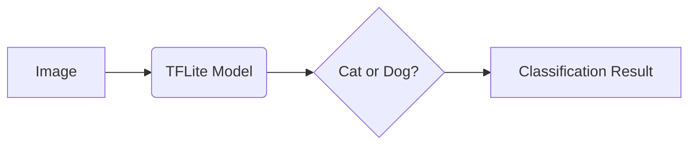
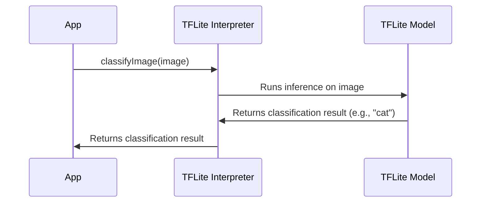

# Chapter 3: TFLite Model

In the previous chapter, [Asset Management (assets/ directory)](02_asset_management__assets__directory__.md), we learned how to store our app's resources, including where to put our TFLite model. Now, let's dive into what this "TFLite model" actually *is*. Think of it like this: we have the photo (thanks to the [Image Picker (`image_picker` package)](01_image_picker___image_picker__package__.md)), and we have a place to store the 'brain' that will tell us if it's a cat or a dog.  This chapter is all about that 'brain'!

**Why do we need a TFLite Model?**

Imagine you want your app to identify whether a picture is of a cat or a dog. You could try to write rules yourself, like "if it has pointy ears and a long tail, it's probably a dog." But that's hard, and those rules wouldn't be very good! A TFLite model is like a pre-trained brain that's already learned to recognize cats and dogs by looking at *thousands* of pictures.  It's much better at it than we could ever be writing rules ourselves!

**Key Concept: What is a TFLite Model?**

A TFLite model is a special file that contains all the "knowledge" needed to perform a specific task, in our case, image classification. Think of it as a recipe for recognizing cats and dogs. This recipe has been created by *training* a machine learning model on a large dataset of cat and dog images.

Here's a breakdown:

*   **Pre-trained "Brain":**  The model is like a brain that's already been taught what cats and dogs look like.
*   **Image Classification:** The model's job is to take an image as input and output what it thinks the image contains (cat or dog).
*   **The File:** The TFLite model is stored as a file (e.g., `model.tflite`). This file contains all the instructions and data needed for the classification process.

**How to Use the TFLite Model**

In our app, we'll load this `model.tflite` file and use it to analyze images. We feed the model an image of a cat or dog, and it tells us what it thinks the image is.

Here's a simplified view:



1.  We give the TFLite model an **Image**.
2.  The model **processes** the image.
3.  The model **outputs** a classification result (cat or dog).

Let's see a simple code snippet (we'll explore this in more detail later):

```dart
// This is a simplified example!
String classifyImage(image) {
  // Load the model
  // Process the image using the model
  // Return "cat" or "dog" based on the model's output
  return "cat"; // For demonstration purposes only
}
```

What's happening here?

*   `classifyImage(image)`: This function takes an image as input.
*   `// Load the model`:  This is where we would load the `model.tflite` file. (We will see later how to load models.)
*   `// Process the image using the model`: This is where we feed the image to the model and ask it to classify it.
*   `// Return "cat" or "dog" based on the model's output`: The model tells us whether it thinks the image is a cat or a dog.
*   `return "cat";`: (Important) Right now, this code *always* returns "cat."  We'll replace this with the real classification logic later.

**Example Input and Output**

*   **Input:** An image of a golden retriever.
*   **Output:** "dog" (Hopefully! The model should be accurate).

*   **Input:** An image of a Siamese cat.
*   **Output:** "cat"

**Under the Hood: How the TFLite Model Works**

Let's take a simplified look at what happens when we use a TFLite model to classify an image.



1.  The App provides the image to be classified and triggers the `classifyImage` function.
2.  The `TFLite Interpreter` is the interface to run the model. It takes the image, preprocesses it as needed, and hands it to the model.
3.  The `TFLite Model` itself performs calculations and returns classification result to the `TFLite Interpreter`.
4.  The `TFLite Interpreter` interprets the raw output from the model (e.g., a list of confidence scores) and gives a higher level prediction, then returns it to the app.
5.  The App displays the result.

The actual implementation involves loading the model with `tflite_flutter` package which we will discuss in the next chapter [`tflite_flutter` Package](04__tflite_flutter__package_.md).

**Conclusion**

In this chapter, you learned what a TFLite model is and why it's essential for our cat and dog classification app.  You learned that it's like a pre-trained brain that can recognize cats and dogs in images.

Now that we understand what a TFLite model is, let's explore how to use it in our Flutter app using the [`tflite_flutter` Package](04__tflite_flutter__package_.md) in the next chapter!


---

Generated by [AI Codebase Knowledge Builder](https://github.com/The-Pocket/Tutorial-Codebase-Knowledge)