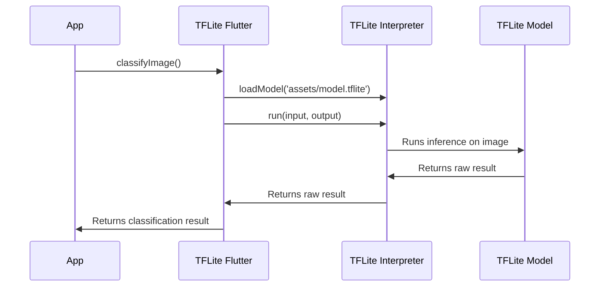

# Chapter 4: `tflite_flutter` Package

In the previous chapter, [TFLite Model](03_tflite_model_.md), we learned about TFLite models themselves – the pre-trained "brains" that can classify images. But how do we actually *use* that brain in our Flutter app? How do we load the model, feed it images, and get the results? That's where the `tflite_flutter` package comes in!

Think of the `tflite_flutter` package as the bridge between your Flutter app and the TFLite model. It's like a translator, taking instructions from your app and converting them into a language the TFLite model understands, and then translating the model's results back into a format your app can use.

**Why do we need the `tflite_flutter` package?**

Imagine trying to talk to someone who only speaks a different language. You'd need a translator! The `tflite_flutter` package does that for your Flutter app and the TFLite model. It handles all the low-level details of:

*   **Loading the model:**  Getting the `model.tflite` file from your [Asset Management (assets/ directory)](02_asset_management__assets__directory__.md) into memory.
*   **Preparing the image:** Converting the image picked by [Image Picker (`image_picker` package)](01_image_picker___image_picker__package__.md) into a format the TFLite model expects.
*   **Running the model (inference):** Giving the image to the model and asking it to classify it.
*   **Interpreting the results:** Turning the model's output (usually numbers) into something meaningful, like "cat" or "dog".

**Key Concepts:**

Let's break down the key concepts involved in using the `tflite_flutter` package:

1.  **Interpreter:** The `Interpreter` is the main class in the `tflite_flutter` package. It's the object that actually loads and runs the TFLite model. Think of it as the "brain operator" – the one who knows how to use the brain (the TFLite model).

2.  **Input Tensor:** The input tensor is how we feed the image data into the model.  Tensors are multi-dimensional arrays, and the TFLite model expects the image to be in a specific tensor format (e.g., a 3D array of pixel values).

3.  **Output Tensor:** The output tensor is where the model puts its classification results. It's usually an array of numbers, where each number represents the model's confidence that the image belongs to a particular class (e.g., the first number might be the confidence that it's a "cat", and the second number might be the confidence that it's a "dog").

**How to Use the `tflite_flutter` Package**

Let's see how to use the `tflite_flutter` package to classify an image. Here's a simplified example:

```dart
import 'package:tflite_flutter/tflite_flutter.dart';

Future<String> classifyImage() async {
  // 1. Load the model
  final interpreter = await Interpreter.fromAsset('assets/model.tflite');

  return "cat"; // Simplified for demonstration
}
```

What's happening here?

1.  `import 'package:tflite_flutter/tflite_flutter.dart';`:  We import the `tflite_flutter` package so we can use its features.
2.  `final interpreter = await Interpreter.fromAsset('assets/model.tflite');`: This line loads the TFLite model from the `assets/` directory. The `Interpreter` class handles loading the model from the file.

Let's add feeding data to the model.

```dart
import 'package:tflite_flutter/tflite_flutter.dart';

Future<String> classifyImage() async {
  // 1. Load the model
  final interpreter = await Interpreter.fromAsset('assets/model.tflite');

  // 2. Prepare input data (simplified)
  final input = [/* Image data as a tensor */];

  // 3. Prepare output buffer
  final output = [/* Output buffer to store results */];

  // 4. Run the model
  interpreter.run(input, output);

  return "cat"; // Simplified for demonstration
}
```

What's happening here?

1.  `final input = [/* Image data as a tensor */];`:  Placeholder to convert image to the right format.
2. `final output = [/* Output buffer to store results */];`: Placeholder to prepare space for the classification results.
3.  `interpreter.run(input, output);`:   This line actually runs the model. We give it the input data (the image) and a buffer to store the output.

Of course, the exact format of the input and output depends on the specific TFLite model you're using.  The `tflite_flutter_helper` package can help with this, as we'll see in the next chapter [`tflite_flutter_helper` Package](05__tflite_flutter_helper__package_.md).

**Example Input and Output**

Let's say we have a `model.tflite` trained to recognize cats and dogs.

*   **Input:** The `classifyImage` function is called. The `model.tflite` is loaded. The interpreter runs the model with the input image.
*   **Output:** The `output` buffer contains the classification result.

**Under the Hood: How `tflite_flutter` Works**

Let's take a simplified look at what happens when you use the `tflite_flutter` package to classify an image:



1.  Your app calls `classifyImage()`.
2.  `TFLiteFlutter` loads the model using `TFLiteInterpreter`.
3.  Your app prepares the image data into the format `TFLiteInterpreter` supports.
4.  `TFLiteInterpreter` passes image data to the `TFLite Model`.
5.  The `TFLite Model` performs calculations and returns raw classification result to the `TFLiteInterpreter`.
6.  `TFLiteInterpreter` interprets the raw output from the model.
7.  `TFLiteFlutter` returns the higher level prediction to the app.
8.  The app displays the result.

**Diving Deeper: Key Classes**

Let's look at how the classes are used in the `classifyImage` function in `main.dart`

```dart
  Future<String> classifyImage(File image) async {
    // ... image preprocessing ...

    var output = List<double>.filled(labels.length, 0).reshape([1, labels.length]);

    interpreter.run(inputImageBuffer.buffer, output);

    // ... post processing ...
  }
```

What's happening here?

* `output = List<double>.filled(labels.length, 0).reshape([1, labels.length]);`: The `output` buffer is initialized as a list of doubles. `reshape` ensures output has right tensor shape that the model expects.
* `interpreter.run(inputImageBuffer.buffer, output);`: The `run` method does the actual work, running inference on the input and writing the raw result to the output.

**Conclusion**

In this chapter, you learned how to use the `tflite_flutter` package to load a TFLite model and run it on an image. You learned about the key concepts of `Interpreter`, input tensors, and output tensors.

Now that we know how to use `tflite_flutter` package, let's explore how to simplify the process of preparing input data and interpreting the output using [`tflite_flutter_helper` Package](05__tflite_flutter_helper__package_.md) in the next chapter!


---

Generated by [AI Codebase Knowledge Builder](https://github.com/The-Pocket/Tutorial-Codebase-Knowledge)