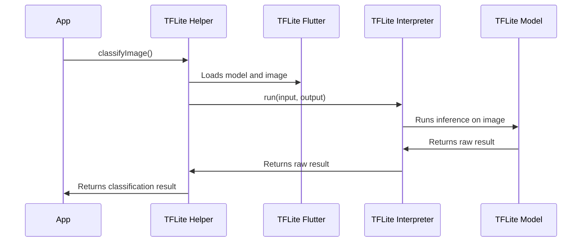

# Chapter 5: `tflite_flutter_helper` Package

In the previous chapter, [`tflite_flutter` Package](04__tflite_flutter__package_.md), we learned how to use the `tflite_flutter` package to load and run our TFLite model. But preparing the image data and interpreting the model's raw output can be tricky!  That's where the `tflite_flutter_helper` package comes in to make our lives easier.

Think of the `tflite_flutter_helper` package as a helpful assistant that prepares the image for the model and translates the model's output back into something we understand. It's like a sous-chef in a kitchen, doing all the prep work so the main chef (you!) can focus on the important stuff.

**Why do we need the `tflite_flutter_helper` package?**

Imagine you're trying to bake a cake, but you have to grind the flour, churn the butter, and crack the eggs *perfectly* before you can even start mixing. That's what working with the raw `tflite_flutter` package can feel like! The `tflite_flutter_helper` package takes care of these tedious pre- and post-processing steps, allowing you to focus on the core logic of your app. Specifically, it helps with:

*   **Resizing the image:** Our model might expect images of a specific size (e.g., 224x224 pixels). The `tflite_flutter_helper` package can automatically resize the image to the correct dimensions.
*   **Normalizing the image:** Models often work best with pixel values between 0 and 1. The package can normalize the pixel values for you.
*   **Converting raw output to probabilities:** The TFLite model gives raw number. We need to know the *chance* of each label.

**Key Concepts:**

Let's look at the main thing that the `tflite_flutter_helper` package brings:

1.  **Image Preprocessing:** Changing the input image into the format the model expects. This includes resizing, cropping, and normalizing pixel values.
2.  **Results Postprocessing:** Converting the raw model output (usually a list of numbers) into human-readable labels like "cat" or "dog," along with confidence scores (e.g., "85% confident this is a dog").

**How to Use the `tflite_flutter_helper` Package**

Let's update the `classifyImage` function to use the `tflite_flutter_helper` package. Note: This example skips image processing steps for clarity.

```dart
import 'package:tflite_flutter/tflite_flutter.dart';
import 'package:tflite_flutter_helper/tflite_flutter_helper.dart';

Future<String> classifyImage() async {
  // 1. Load the model (same as before)
  final interpreter = await Interpreter.fromAsset('assets/model.tflite');

  // 2. [OLD] Prepare input data (simplified)
  // final input = [/* Image data as a tensor */];

  // 2. [NEW] Use ImageProcessorBuilder to process image

  // 3. [OLD] Prepare output buffer
  // final output = [/* Output buffer to store results */];

  // 3. [NEW] TensorBuffer for output
  TensorBuffer output = TensorBuffer.createFixedSize(<int>[1, 2], TfLiteType.float32);

  // 4. Run the model (same as before)
  // interpreter.run(input, output);
  // 4. [NEW] Run inference
  interpreter.run(null, output.buffer);

  // 5. Get and print result
  print(output.getDoubleList());

  return "cat"; // Simplified for demonstration
}

```

What's happening here?

*   `import 'package:tflite_flutter_helper/tflite_flutter_helper.dart';`: We import the `tflite_flutter_helper` package.
*   `TensorBuffer output = TensorBuffer.createFixedSize(<int>[1, 2], TfLiteType.float32);`: Placeholder to prepare space for the classification results using `TensorBuffer`. Here we assume the output is a list of 2 floating point values (confidence for cat, confidence for dog).
*   `interpreter.run(null, output.buffer);`: We pass the output buffer to the `run` function.
*   `print(output.getDoubleList());`: Print the output (example: `[0.9, 0.1]` which means 90% confidence for "cat" label)

**Example Input and Output**

*   **Input:** The `classifyImage` function is called with no image.
*   **Output:** Confidence score is printed in the console.

**Under the Hood: How `tflite_flutter_helper` Works**

Let's take a simplified look at what happens when you use the `tflite_flutter_helper` package to classify an image:



1.  Your app calls `classifyImage()`.
2.  The helper prepares input (resizes image, etc.).
3.  The helper calls `TFLiteFlutter` to load the model if it hasn't loaded already.
4.  The helper runs the model using `TFLiteInterpreter`.
5.  The model performs the classification.
6.  The helper receives and processes the raw results.
7.  The helper returns the final, human-readable result to your app.
8.  The app displays the result.

**Diving Deeper: `ImageProcessor` and `TensorImage`**

The `tflite_flutter_helper` package provides classes to help with image processing. A central concept is `ImageProcessor`, which is used to build a processing pipeline, and `TensorImage` to wrap the input image.

A sample code snippet using the `ImageProcessor` and `TensorImage` is

```dart
  // Create TensorImage from image file
  TensorImage inputImage = TensorImage.fromFile(File);

  // Create processor
  ImageProcessor imageProcessor = ImageProcessorBuilder()
      .add(ResizeOp(224, 224, ResizeMethod.bilinear))
      .add(NormalizeOp(127.5, 127.5))
      .build();

  // Process image
  inputImage = imageProcessor.process(inputImage);
```

What's happening here?

*   `TensorImage inputImage = TensorImage.fromFile(File);`: Creates a TensorImage that wraps the image.
*   `ImageProcessor imageProcessor = ImageProcessorBuilder()...build();`: Creates an image processor pipeline.
*   `.add(ResizeOp(224, 224, ResizeMethod.bilinear))`: Resize image to 224x224 using bilinear interpolation.
*   `.add(NormalizeOp(127.5, 127.5))`: Normalize the image.
*   `inputImage = imageProcessor.process(inputImage);`: The final processed image.

**Conclusion**

In this chapter, you learned how the `tflite_flutter_helper` package simplifies the process of working with TFLite models by handling image preprocessing and result postprocessing. You saw how it makes your code cleaner and easier to understand. It makes building a cat-dog classifier much easier.

With the knowledge you've gained in these chapters, you're now well-equipped to build your own cat and dog classification app! You know how to pick images, manage assets, understand TFLite models, and use the `tflite_flutter` and `tflite_flutter_helper` packages to run the model. Good luck!


---

Generated by [AI Codebase Knowledge Builder](https://github.com/The-Pocket/Tutorial-Codebase-Knowledge)